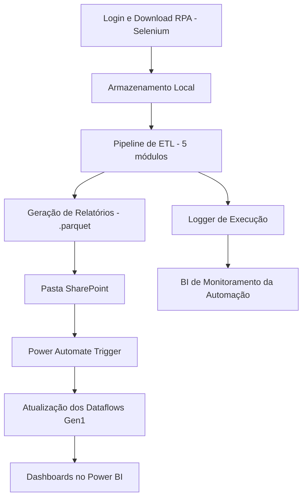

# 🧠 Web Data Collector: Arquitetura Híbrida RPA + ETL Automatizado

Este projeto entrega uma solução de automação de dados ponta a ponta, integrando **RPA com pipelines de dados**, visando automatizar a coleta, transformação e publicação de indicadores críticos. 

## 🚀 Visão Geral

A arquitetura proposta combina **Selenium RPA**, **ETL em Python**, e orquestração via **Power Automate + SharePoint + Power BI**, gerando indicadores atualizados automaticamente com base em arquivos baixados de um sistema legado.

---

## 🎯 Objetivo do Projeto

Automatizar o processo de extração de dados de um sistema interno, transformá-los com lógica de negócios aplicada e integrá-los em um pipeline que atualiza **dataflows do Power BI**. A cadeia completa é monitorada por logs processados em tempo real por um BI de acompanhamento das automações.

---

## 🛠️ Stack Tecnológica

### Linguagens e Plataformas:
- Python 3.11
- Power BI (Dataflows Gen1)
- Power Automate
- SharePoint Online

### Principais Bibliotecas:
- `selenium`: Automação RPA (login + download)
- `pandas` / `numpy`: ETL e cálculos
- `dotenv`, `pathlib`, `logging`: Gestão de ambiente e logging
- `python-dateutil`, `pytz`, `tzdata`: Tratamento de datas e fuso horário

---

## 🧩 Arquitetura Modular

## 👨‍💻 Autor

**Vinicius Giovanni**  
*Analista de Dados Júnior | Foco em Pipelines, ETL, Power BI e Engenharia de Dados*  
[LinkedIn](https://www.linkedin.com/in/vin%C3%ADcius-giovanni-139941297/) · [GitHub](https://github.com/Vinicius-Giovanni)
